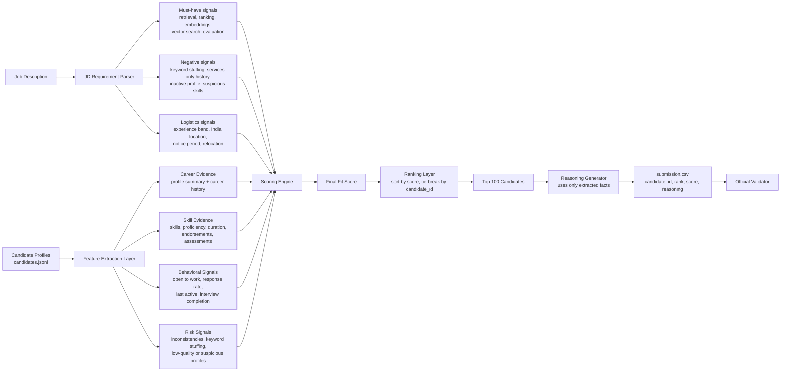

# Redrob AI Candidate Ranker

Career-first candidate ranking system for the Redrob Intelligent Candidate Discovery & Ranking Challenge.

The ranker is built for the challenge constraints:

- CPU only
- no network calls during ranking
- under 5 minutes for 100k candidates
- reproducible from `candidates.jsonl`

## Demo Video

[Watch the walkthrough](https://1drv.ms/v/c/4c036607c49a6aa8/IQBMcAU0S0rPSJvRqDpt5nZzAfV034fiFyWGg8Jz9hMupkI?e=Fh8001)

## Approach

The job description asks for a Senior AI Engineer who has shipped production retrieval, ranking, search, recommender, or LLM systems. The dataset intentionally contains candidates with many AI keywords but weak career evidence, so this solution ranks candidates by demonstrated work rather than keyword count.

### Architecture



The score combines:

- career evidence from profile summaries and role descriptions
- role and title fit
- production search/ranking/retrieval experience
- product-company and startup fit
- location, notice period, and availability
- Redrob behavioral signals
- risk penalties for keyword stuffing, services-only history, inactive profiles, and honeypot-like inconsistencies

## Quick Start

```bash
python rank.py --candidates "./data/[PUB] India_runs_data_and_ai_challenge/India_runs_data_and_ai_challenge/candidates.jsonl" --out submission.csv
```

Validate:

```bash
python "./data/[PUB] India_runs_data_and_ai_challenge/India_runs_data_and_ai_challenge/validate_submission.py" submission.csv
```

## Files

- `rank.py` - CLI entrypoint
- `src/redrob_ranker/features.py` - feature extraction and text evidence
- `src/redrob_ranker/scoring.py` - scoring rubric
- `src/redrob_ranker/reasoning.py` - short recruiter-facing explanations
- `submission_metadata.yaml` - metadata template filled for this repo
- `submission.csv` - generated top-100 output


